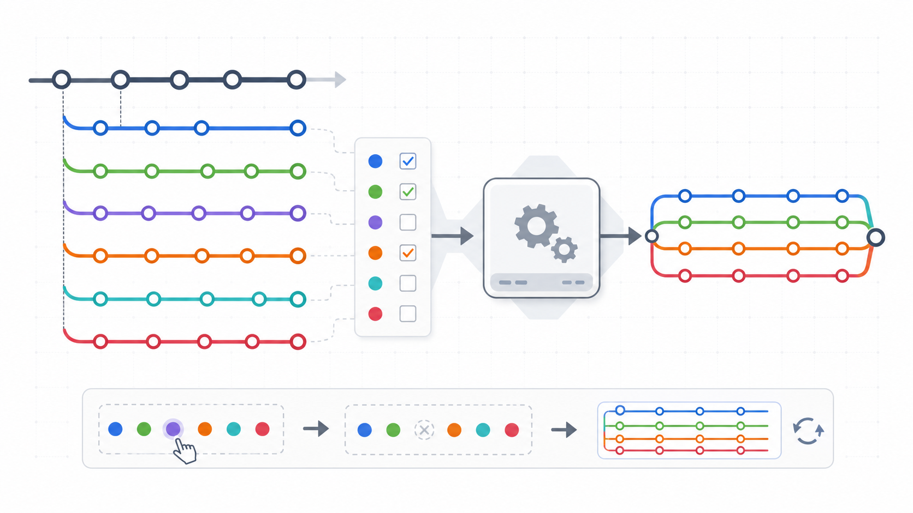
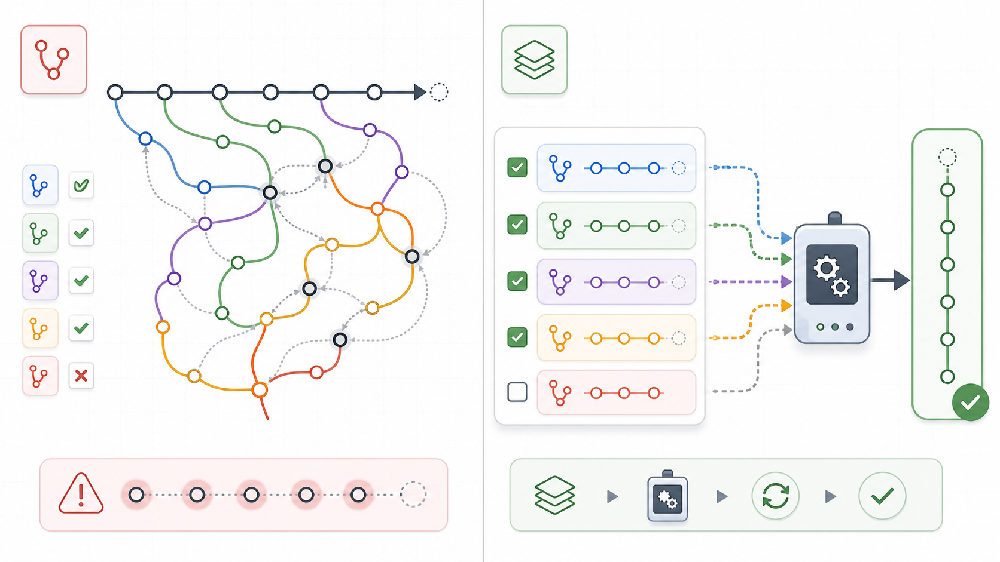

<p align="center">
  
</p>

# Hitch

> Git branch management for environment-based deployments

Hitch treats environment branches as composable layers, not ordinary Git merge targets. You keep working on normal feature or bug branches, promote those branches into an environment's list, and Hitch rebuilds the environment branch from that list. Demote a branch to remove it from the environment. Release commands are available, but the core idea is explicit branch composition rather than manual environment merges.

## 🚀 Quick Start

```bash
# Initialize Hitch in your Git repository
hitch init

# Add environments for your deployment pipeline
hitch add dev --base main
hitch add qa --base main
hitch add production --base main

# Promote branches to environments
hitch promote feature/user-auth dev
hitch promote feature/user-auth qa
hitch promote feature/user-auth production

# Check the status of all environments
hitch status
```

## 🎯 What Problem Does Hitch Solve?

- **"What branches are actually in `dev` right now?"** – Full audit trail of promotions
- **"How do I rebuild `qa` with the latest from all promoted features?"** – `hitch rebuild` regenerates environment branches
- **"Can I test one feature in `dev`, then the same feature in `qa`, then ship it to `main`?"** – One possible workflow is to promote the feature branch through each environment
- **"Can I add or remove individual features from a test environment?"** – Each promoted branch is an entry in the environment's branch list
- **"How is this different from normal Git merging?"** – Environments are rebuilt from a declared list of branches instead of accumulating hand-made merge commits
- **"Can we freeze production during critical periods?"** – `hitch lock production`
- **"How do we require team approval before production deployments?"** – Approval workflow with configurable thresholds

## 🔧 Core Concepts

### Environment Branches Are Rebuilt From a List

Hitch's main difference from plain Git merging is that an environment is defined by metadata: a base branch plus an ordered list of promoted branches. The environment branch is output that Hitch can regenerate.

<p align="center">
  
</p>

One common workflow is to let a feature branch move through deployment environments:

```bash
# Work on a feature or bug branch as usual
git checkout -b feature/user-auth main

# Put that feature onto the dev environment branch
hitch promote feature/user-auth dev
# CI/CD for dev can now deploy the dev branch

# When dev testing passes, put the same branch onto qa
hitch promote feature/user-auth qa
# CI/CD for qa can now deploy the qa branch

# When qa passes, release it to main or production
hitch release qa main
# CI/CD for main can now deploy the production site
```

This gives you a visible list of single features layered on top of the source branch (`main`). You can add a branch to an environment with `promote`, remove it with `demote`, and rebuild the environment branch from the current list at any time.

### Environments as Composable Layers

Each environment branch is a stack built on top of a base:

```
production = main + feature/auth
qa         = main + feature/auth + feature/payments
dev        = main + feature/auth + feature/payments + feature/ui + feature/api
```

When you promote or demote, Hitch rebuilds the environment by squashing all promoted branches together. Environment branches are **regenerated**, not manually merged.

<p align="center">
  
</p>

Rebuild is a read-only assembly check first: if any promoted branch can't be composed cleanly (in order) on top of the base, `hitch rebuild` refuses and tells you exactly which branch and files to fix.

### Release and Merge Fixes

`hitch release <environment> <target>` merges the environment's promoted branches into a target branch and lets your existing CI/CD take over from there. Some teams use this to move tested changes from `dev` to `qa` to `main`; others may use Hitch only to assemble and rebuild test environments.

The tradeoff is merge fixes. Because Hitch repeatedly composes branches against a base and against each other, conflicts are still real Git conflicts. If a branch needs a compatibility fix in one environment, you may need to carry that fix back into the branch or repeat equivalent fixes when composing it elsewhere. Hitch makes the environment contents explicit and rebuildable; it does not erase the underlying Git cost of resolving conflicting changes.

**Release also rebuilds dependent environments.** Once a release moves `<target>`, any environment whose `base` is `<target>` — and transitively, any environment based on *those* — is now stale relative to its own definition, so Hitch rebuilds (and pushes) each of them as part of the same release. This is common: if `dev`'s base is `main` and you `hitch release dev main`, `dev` itself qualifies and gets rebuilt right after. In practice this is usually a no-op, since `main` now already contains what `dev` was rebuilding from — it only does real work when other promoted branches or dependent environments are still layered on top. This step is best-effort (a rebuild failure is reported as a warning, not a release failure) and can be skipped with `--no-rebuild-dependents`.

## 📋 Key Commands

```bash

# Create a new feature branch and set up promotion targets
hitch branch feature/foo develop --to dev --to qa

# Create a branch and set up promotion targets
hitch branch feature/foo main --to dev --to qa

# Open a GitHub PR (infers base from promotion targets)
hitch pr

# Diagnose gh setup for hitch pr
hitch doctor

# Promote/demote branches through environments
hitch promote feature/new-api dev
hitch demote feature/new-api dev

# Rebuild environment with all promoted branches
hitch rebuild production

# Lock/unlock environments (freeze promotions)
hitch lock production
hitch unlock production

# View environment status
hitch status

# View branch hierarchy
hitch tree

# Release environment to target branch
hitch release production main

# Guard environment branches from direct commits
hitch guard

# Update environment configuration
hitch set dev --base main           # Change base branch
hitch set production --requires-approval true
hitch set production --min-approvals 2
hitch set production --add-approver alice@example.com
```

## 🖥️ Desktop GUI (`hitch-desktop`)

Hitch also ships with a desktop GUI as a separate tool: `hitch-desktop`.

The CLI (`hitch`) is always available and prints help when run with no subcommand:

```bash
hitch --help
hitch status
hitch rebuild dev
```

### Development (from source)

```bash
# From the repo root
just desktop-dev
```

### Build (macOS)

```bash
# Builds a .dmg in crates/hitch-desktop/src-tauri/target/release/bundle/
just desktop-build-dmg
```

If you update `hitch.svg` and want the desktop app icon to match:

```bash
just desktop-icons
```

## 🛡️ Approval Workflow

For sensitive environments, require multi-person approval before promotions:

```json
// hitch.json
{
  "environments": {
    "production": {
      "requires_approval": true,
      "min_approvals": 2
    }
  }
}
```

```bash
# Request promotion (requires approval before applying)
hitch promote feature/new-api production

# Approvers approve the request
hitch approvals approve <request-id> "Ready for production"

# View pending requests
hitch approvals list --status pending
```

> **Note:** The approval workflow is an advisory/audit aid, not a security
> boundary. Approver identity comes from local `git config user.email`, and the
> approval state lives in the `hitch-metadata` branch that anyone with write
> access can edit. For real enforcement, use server-side branch protection and
> required reviews. See [SECURITY.md](SECURITY.md) for details. Note also that
> `hitch release` is **not** approval-gated — releasing an approval-required
> environment requires `--force`.

See [DEVELOPMENT.md](DEVELOPMENT.md) for detailed approval workflow documentation.

## 🔀 GitHub Pull Requests with Hitch

When `main` is production and environment branches (`dev`, `qa`) are rebuilt by Hitch, there's no obviously valid branch to target a GitHub PR against — environment branches are force-pushed on every rebuild, which invalidates any open PR.

Hitch solves this by treating `hitch release` as the actual merge step, not GitHub's merge button:

```bash
git checkout -b feature/foo main                       # create branch
hitch branch feature/foo main --to dev --to qa         # set promotion targets
hitch pr                                               # push to origin and open PR

hitch promote feature/foo dev                         # rebuilds/deploys dev only
hitch promote feature/foo qa                          # rebuilds/deploys qa only

hitch release qa main                                 # one push to main, one prod deploy
```

### How it works

1. **PRs target `main`.** Opening, reviewing, and approving a PR are read-only operations on GitHub's side — they never write to `main`. A GitHub ruleset blocks the push that clicking "Merge" would attempt, for anyone except the accounts allowed to run `hitch release` — so an approved PR can't reach production through the GitHub UI for anyone else.

2. **`hitch release` does `--no-ff` merges** of each promoted branch into the target. When GitHub sees the PR's head commits become reachable from `main`, it automatically marks the PR as **Merged**. No webhooks, no API integration — the PR lifecycle becomes truthful for free.

3. **The PR is open from day one** for code review. Testing and deployment gates (`hitch promote`, `hitch release`) run alongside, not instead of, the PR.

### GitHub configuration

Create a **repository ruleset on `main`** (not classic branch protection — see below) with an `update` rule (blocks all pushes, including merge-button clicks), bypassed only by the accounts allowed to run `hitch release`:

- Rulesets can't bypass one specific person directly — only a role (org owner / repo admin), a team, a GitHub App, or a deploy key, and role-based bypass readmits everyone with that role. Create a small dedicated team scoped to exactly the intended release identities and bypass that team.
- Do **not** enable "Require a pull request before merging" — that rule lets non-bypass actors merge via an approved PR instead of being blocked outright, and would separately reject `hitch release`'s own push unless exempted.
- Required approvals / required reviews (via classic protection, which layers independently) can stay on — they gate nothing hitch does but keep review discipline visible.

**Why a ruleset, not classic branch protection's "Restrict who can push":** classic protection's admin bypass (`enforce_admins`) is all-or-nothing — off, and *every* repo admin/org owner bypasses the restriction, not just your intended release identities; on, and admins also get blocked by required PR reviews, breaking `hitch release`'s own push. Rulesets support an explicit bypass list independent of admin/owner role.

**Residual gap:** GitHub can't tell "pushed via `git push`" apart from "pushed by clicking Merge" for the same identity — both are just a push. So bypass-listed accounts can still technically click merge on an approved PR; only non-bypass accounts are fully blocked. Disabling the repo's PR merge methods doesn't fix this (GitHub requires at least one enabled, and it wouldn't stop a bypass actor anyway). Use a bot/deploy-key bypass identity if no human should ever be able to merge via GitHub; otherwise this is a process-discipline tradeoff for whoever's on the bypass team.

Hitch's existing environment gates (`requires_approval`, `min_approvals`, `lock`) remain the release-time authority, as today.

### `hitch pr` command

Open a GitHub PR for the current branch:

```bash
hitch pr                  # infers PR base from promotion targets, pushes, runs gh pr create
hitch pr --title "Add login" --draft
hitch pr --base develop   # override inferred base
```

The PR base is inferred from the shared `base` branch of all environments the branch is promoted to.

### `hitch doctor` command

Verify that `gh` is installed, authenticated, and has the scopes `hitch pr` needs:

```bash
hitch doctor
# gh found on PATH (/usr/bin/gh)
# Authenticated to github.com as your-github-username (active)
#   Scopes: repo, workflow
# All checks passed — 'hitch pr' should work.
```

`hitch doctor` checks for `gh` on PATH, authentication status against each GitHub host, and that the classic token carries the `repo` scope. It's safe to run anytime — it only reads, never writes.

### Squash releases

`hitch release --squash` rewrites commits, so GitHub cannot auto-detect the merge. Use normal `--no-ff` merges (the default) when using GitHub PRs so the PR lifecycle stays accurate.

## 📦 Installation

### Cargo (Recommended)
```bash
cargo install hitch
```

### From Source
```bash
git clone https://github.com/doomedramen/hitch
cd hitch
cargo install --path .
```

### Homebrew (macOS)
```bash
brew install doomedramen/homebrew-hitch/hitch
```

## 🔧 Development

See [DEVELOPMENT.md](DEVELOPMENT.md) for development setup and guidelines.

## 📄 License

MIT License
