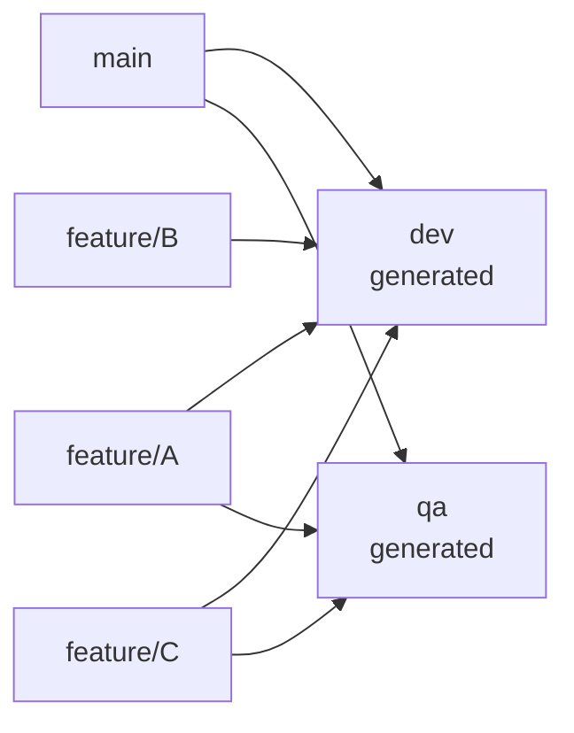
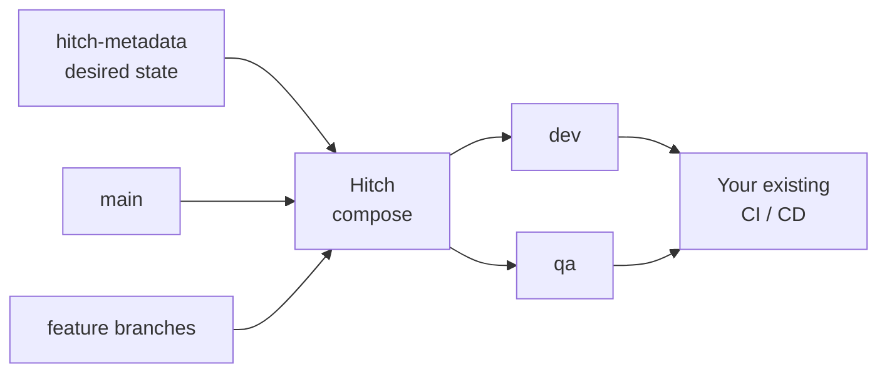
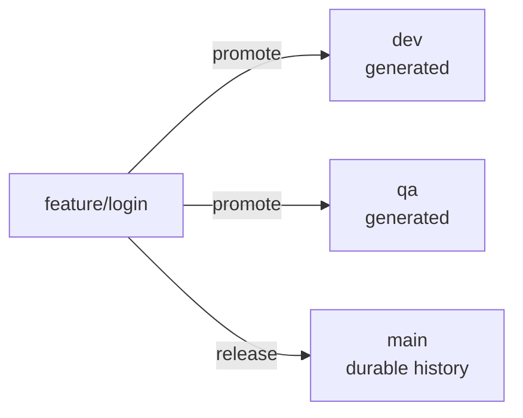
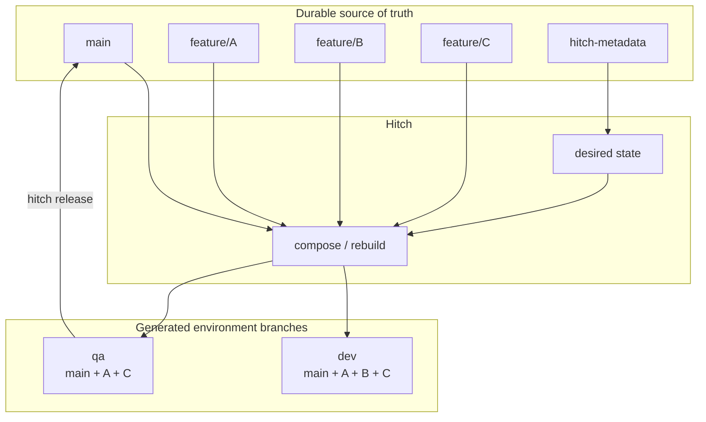

<p align="center">
  
</p>

# Hitch

> **Git environments as desired state, not merge history.**

Hitch is a Git tool for teams where branches such as `dev`, `qa`, or `staging` represent deployed environments.

Instead of permanently merging work into those branches, Hitch treats them as **generated outputs**.

You tell Hitch which feature branches should exist in an environment:

```text
dev = main + feature/auth + feature/search + feature/new-ui

qa  = main + feature/auth + feature/search
```

Hitch builds the corresponding `dev` and `qa` branches for you.

**That is the core idea.**

---

## Why does Hitch exist?

A common Git deployment workflow looks roughly like this:

```text
feature branches
       ↓
      dev
       ↓
      qa
       ↓
     main
```

This seems simple until several features are being worked on at once.

Imagine `dev` contains:

```text
feature/A
feature/B
feature/C
```

`A` and `C` are ready for QA.

`B` is not.

If `dev` is just a normal branch containing accumulated merges, you now have a problem:

**How do you move the tested work forward without also moving `B`?**

You can start cherry-picking, reverting, maintaining multiple integration branches, or carefully merging individual features into every environment.

But your environment branches gradually become another source of truth that humans have to manage.

Hitch changes that model.

### Environment branches are outputs

With Hitch:

```text
dev = main + A + B + C

qa  = main + A + C
```

`dev` and `qa` are not the history of how changes arrived there.

They simply represent:

> **What should be deployed here right now?**



If `B` is removed from `dev`, Hitch just rebuilds:

```text
dev = main + A + C
```

There is no need to work out how to "undo the merge of B without undoing everything after it."

---

# The mental model

There are four important kinds of branch in a Hitch repository:

| Thing             | Purpose                                                     |
| ----------------- | ----------------------------------------------------------- |
| `main`            | Durable Git history / release branch                        |
| `feature/*`       | The real work developers create and review                  |
| `dev`, `qa`, etc. | Generated environment branches                              |
| `hitch-metadata`  | Hitch's declaration of what each environment should contain |

The important distinction is:

```text
feature branches + main = source

dev / qa / staging      = generated output
```

You should not manually maintain Hitch environment branches.

Hitch can regenerate them whenever their inputs change.

---

# How Hitch works

Each environment has:

```text
base + ordered list of branches
```

For example:

```text
dev:
    base: main
    branches:
        - feature/auth
        - feature/payments
        - feature/new-ui
```

Conceptually, Hitch evaluates:

```text
dev = main
    + feature/auth
    + feature/payments
    + feature/new-ui
```

and publishes the result as the `dev` branch.

The configuration is stored in `hitch.json` on the dedicated `hitch-metadata` branch.



Hitch does **not** replace your deployment system.

Your CI/CD can continue deploying when `dev`, `qa`, `main`, etc. change exactly as it does today.

Hitch controls **what Git puts on those branches**.

---

# A normal Hitch workflow

Install Hitch:

```bash
cargo install hitch
```

or on macOS:

```bash
brew install doomedramen/homebrew-hitch/hitch
```

Initialize it:

```bash
hitch init

hitch add dev --base main
hitch add qa --base main
```

Then develop normally:

```bash
git switch -c feature/login main

# work, commit, push...
```

Deploy the feature to development:

```bash
hitch promote feature/login dev
```

Hitch now declares:

```text
dev = main + feature/login
```

and rebuilds `dev`.

Once it passes development testing:

```bash
hitch promote feature/login qa
```

Now:

```text
dev = main + feature/login
qa  = main + feature/login
```

### Notice what did *not* happen

Hitch did **not** merge:

```text
dev → qa
```

It added the same real feature branch to QA's desired state.

That distinction is important.

If `dev` also contained experimental work:

```text
dev = main + login + new-dashboard + debug-tools
```

QA can still be:

```text
qa = main + login
```

without taking the other changes with it.

---

# Releasing

Environment branches are temporary compositions.

Your feature branches contain the real work.

When an environment has been tested and you want those features to become part of a durable branch:

```bash
hitch release qa main
```

Hitch merges the feature branches promoted to `qa` into `main`.



So the lifecycle is:

```text
feature branch
      │
      ├── promote → dev
      │
      ├── promote → qa
      │
      └── release → main
```

The feature branch is the durable unit moving through the system.

The environment branches are just different compositions of those units.

`release` is optional: Hitch can also be used purely to build temporary integration environments if your existing release process handles production differently.

---

# Promotion and demotion

### Promote

```bash
hitch promote feature/foo dev
```

means:

> Add `feature/foo` to the list of things that should be in `dev`.

By default Hitch then rebuilds the environment.

### Demote

```bash
hitch demote feature/foo dev
```

means:

> Remove `feature/foo` from the list of things that should be in `dev`.

Hitch regenerates the environment without it.

So if:

```text
dev = main + A + B + C
```

then:

```bash
hitch demote B dev
```

produces:

```text
dev = main + A + C
```

This is one of the main reasons environment branches are generated rather than maintained manually.

---

# Rebuilding

You can regenerate an environment at any time:

```bash
hitch rebuild dev
```

This takes the environment's current declaration and recreates its branch from the current inputs.

You can preview the result first:

```bash
hitch rebuild dev --dry-run
```

Or see current conflicts:

```bash
hitch conflicts dev
```

Hitch performs composition away from your normal working checkout, so rebuilding an environment does not require Hitch to check out `dev` over your work.

---

# What happens when branches conflict?

Git conflicts still exist.

Hitch makes them visible and gives them environment-level semantics rather than pretending they disappear.

If an already-promoted branch no longer composes cleanly, the default rebuild policy is to **hold** that branch:

```text
dev = main + A + B + C

B conflicts
       ↓

build = main + A + C
held  = B
```

`B` remains part of the environment declaration and will be tried again on future rebuilds.

You can see held branches with:

```bash
hitch conflicts dev
```

and use the guided resolver:

```bash
hitch resolve dev
```

Hitch distinguishes two important cases:

```text
feature ↔ base conflict
        → fix the feature branch, normally by rebasing

feature ↔ feature conflict
        → resolve their environment composition
```

If you prefer an environment to fail completely rather than build without a conflicting branch:

```bash
hitch set dev --on-conflict halt
```

A **release is always all-or-nothing**: Hitch does not partially merge a broken environment into the release target.

For advanced reusable conflict resolutions, see [`docs/merge-conflict-handling-plan.md`](docs/merge-conflict-handling-plan.md).

---

# GitHub Pull Requests

Because Hitch environment branches are generated and may be replaced during rebuilds, you generally should **not target PRs at `dev` or `qa`**.

PRs target the durable base branch — usually `main`.

```text
feature/foo ── PR ───────→ main
     │
     ├── promoted → dev
     ├── promoted → qa
     │
     └── hitch release qa main
                     │
                     └── GitHub sees the feature commits on main
                         and marks the PR merged
```

Hitch can create the PR:

```bash
hitch pr
```

and can configure the GitHub protection needed for this workflow:

```bash
hitch setup
```

By default `hitch release` preserves Git ancestry, allowing GitHub to recognise the feature PR as merged when its commits reach `main`.

If you use:

```bash
hitch release --squash
```

that ancestry is rewritten, so GitHub cannot automatically detect the PR as merged.

See [`docs/github-pr-workflow-plan.md`](docs/github-pr-workflow-plan.md) for the full GitHub model.

---

# See what is deployed

```bash
hitch status
```

shows your environments and their promoted branches.

```bash
hitch tree
```

shows the relationship between environments and branches.

This makes questions such as:

```text
What is in dev?

What has made it to QA?

What is being held because of a conflict?

Which features would be released?
```

answerable from Hitch's explicit state rather than reconstructed from Git merge history.

---

# Safety controls

Environments can be frozen:

```bash
hitch lock production
hitch unlock production
```

Promotions can require approval:

```bash
hitch set production --requires-approval true
hitch set production --min-approvals 2
```

Multiple changes can be staged before rebuilding:

```bash
hitch promote feature/a dev --no-rebuild
hitch promote feature/b dev --no-rebuild

hitch rebuild dev
```

And commands can operate without pushing:

```bash
hitch --no-push ...
```

---

# Common commands

| Command                       | Meaning                                               |
| ----------------------------- | ----------------------------------------------------- |
| `hitch init`                  | Initialize Hitch                                      |
| `hitch add dev --base main`   | Create an environment                                 |
| `hitch promote A dev`         | Put feature `A` into `dev`                            |
| `hitch demote A dev`          | Remove feature `A` from `dev`                         |
| `hitch rebuild dev`           | Regenerate `dev`                                      |
| `hitch rebuild dev --dry-run` | Preview a rebuild                                     |
| `hitch conflicts dev`         | Show branches that cannot currently compose           |
| `hitch resolve dev`           | Guided conflict resolution                            |
| `hitch status`                | Show environment state                                |
| `hitch tree`                  | Show the environment/branch hierarchy                 |
| `hitch release qa main`       | Merge QA's promoted features into `main`              |
| `hitch lock qa`               | Freeze changes to an environment                      |
| `hitch unlock qa`             | Unfreeze it                                           |
| `hitch pr`                    | Open a PR for the current feature branch              |
| `hitch setup`                 | Configure GitHub protection for the Hitch PR workflow |
| `hitch doctor`                | Check repository/Hitch integration health             |

Run:

```bash
hitch --help
```

for the complete command reference.

---

# What Hitch is not

**Hitch is not a replacement for Git.**

Feature branches, commits, merges, rebases and PRs remain ordinary Git.

**Hitch is not a CI/CD platform.**

It produces environment branches; your existing CI/CD decides what happens when those branches change.

**Hitch does not make merge conflicts disappear.**

It detects them, attributes them and gives you tools for resolving them.

**Environment branches are not normal development branches.**

They are generated output and should not be manually maintained.

---

# The entire idea in one picture



**Feature branches are the work.**

**`hitch-metadata` says where that work should currently appear.**

**Environment branches are generated from that declaration.**

That is Hitch.

---

## Development

See [`DEVELOPMENT.md`](DEVELOPMENT.md).

## License

MIT.
